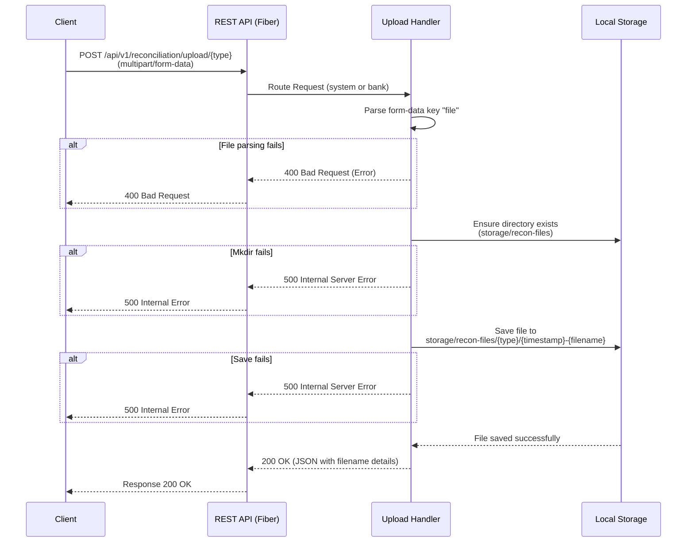

# System Design: Upload Reconciliation File

This document describes the flow, API structure, and design for the CSV file upload feature used to ingest reconciliation data.

## 1. Sequence Diagram

The following sequence diagram illustrates the process of uploading a CSV file (System or Bank).



## 2. API Endpoints

The service categorizes uploads into two sources: **System** records and **Bank** records.

*   **System Upload Endpoint:** `POST /api/v1/reconciliation/upload/system`
*   **Bank Upload Endpoint:** `POST /api/v1/reconciliation/upload/bank`

### Payload Details
Both endpoints expect a `multipart/form-data` payload. 

| Field Name | Type | Description |
| :--- | :--- | :--- |
| `file` | File / Blob | The `.csv` file containing the transactions. For bank files, the filename is typically prefixed with the `BankID` (e.g., `BCA_statement.csv`). |

### Storage Structure
Files are persisted directly onto the server's storage system (or mounted volume). They are prefixed with the Unix timestamp to prevent collision:
- `storage/recon-files/system/1715000000-system_export.csv`
- `storage/recon-files/banks/1715000000-bca_export.csv`

## 3. Request & Response Examples

### Curl Example: Uploading a System CSV

```bash
curl -X POST http://localhost:8080/api/v1/reconciliation/upload/system \
  -H "Content-Type: multipart/form-data" \
  -F "file=@/path/to/your/local/system_transactions.csv"
```

### Curl Example: Uploading a Bank CSV

```bash
curl -X POST http://localhost:8080/api/v1/reconciliation/upload/bank \
  -H "Content-Type: multipart/form-data" \
  -F "file=@/path/to/your/local/BCA_statement.csv"
```

### Success Response (200 OK)

When the server processes and saves the file successfully, it returns a confirmation containing the target file name for tracing.

```json
{
    "filename": "storage/recon-files/system/1712638800-system_transactions.csv",
    "message": "system file uploaded successfully"
}
```

### Error Response (400 Bad Request)

If the `file` field is missing or invalid:

```json
{
    "error": "Failed to parse file upload: http: no such file"
}
```
